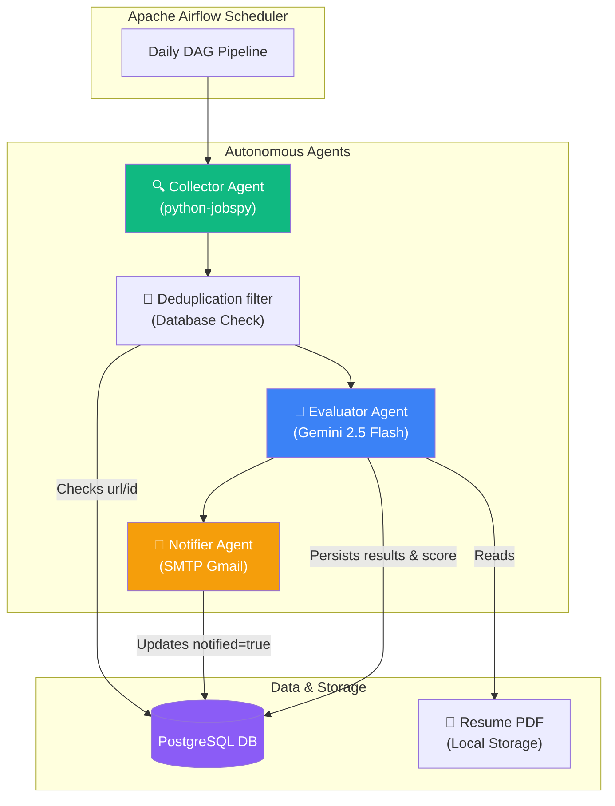

# 💼 Autonomous Job Search AI Agent System

An autonomous multi-agent system designed to automate your job search by collecting job listings, evaluating matches against your resume using LLMs, and notifying you with structured match reports. 

Orchestrated with **Apache Airflow**, persisted with **PostgreSQL**, and powered by **Google Gemini API** for semantic analysis.

---

## 🏗️ System Architecture



---

## 🌟 Key Features

1. **Autonomous Keyword Discovery**: The system parses your PDF resume using `PyMuPDF` and uses the Google Gemini API to extract optimal search terms (e.g., "Python Developer", "ML Engineer") dynamically.
2. **Aggregated Search (Collector Agent)**: Uses the `JobSpy` engine to scrape postings from **LinkedIn, Indeed, and Glassdoor** concurrently.
3. **Structured Semantic Evaluation (Evaluator Agent)**: Sends job descriptions to the Gemini API using Pydantic Models for **Strict JSON Schemas**. The AI rates compatibility (0-100), extracts strong matches (Key Matches), lists discrepancies (Gaps), and suggests actions ("Apply", "Consider", "Skip").
4. **Interactive Local CLI Runner**: Includes a standalone script (`main.py`) to run the entire pipeline instantly on your host machine without needing to set up Docker or Airflow.
5. **Robust Orchestration**: Includes a ready-to-use Dockerized Airflow DAG with built-in retry logic, rate limit handling, logging, and scheduled runs.
6. **Aesthetic Email Notifications**: Delivers reports via HTML emails with styled badges, score indicators, and direct links to apply.

---

## 📂 Project Structure

```
Jobs_Search/
├── docker-compose.yml              # Multi-container Airflow + Postgres setup
├── Dockerfile                      # Custom Airflow image with dependencies
├── .env.example                    # Sample environment variables template
├── .env                            # Application secrets (gitignored)
├── requirements.txt                # Python library dependencies
├── main.py                         # Standalone local CLI runner (quick testing)
│
├── resume/
│   └── curriculo.pdf               # Place your PDF resume here
│
├── dags/
│   └── job_search_dag.py           # Production Apache Airflow DAG
│
└── src/                            # Modular application source code
    ├── config.py                   # Settings management via Pydantic Settings
    ├── models.py                   # Data schema models via Pydantic v2
    ├── database.py                 # PostgreSQL interaction module
    ├── agents/
    │   ├── collector.py            # JobSpy scraping logic
    │   ├── evaluator.py            # LLM evaluation logic
    │   └── notifier.py             # Gmail SMTP HTML delivery
    └── utils/
        ├── resume_parser.py        # PDF parser & keyword extractor
        └── prompts.py              # Strict LLM evaluation prompts
```

---

## 🚀 Getting Started

### 1. Place Your Resume
Create a folder named `resume/` in the project root directory and add your resume in PDF format named **`curriculo.pdf`**:
```bash
mkdir -p resume
# Copy your resume PDF file to: resume/curriculo.pdf
```

### 2. Configure Environment Variables
Copy `.env.example` to `.env` and fill in your keys:
```bash
cp .env.example .env
```
Key configurations:
*   `GEMINI_API_KEY`: Get a free-tier API key from [Google AI Studio](https://aistudio.google.com/apikey).
*   `SMTP_EMAIL` / `SMTP_PASSWORD`: Your email address and a generated Google account [App Password](https://support.google.com/accounts/answer/185833).
*   `SEARCH_LOCATION` / `SEARCH_COUNTRY`: Location criteria (defaults: `Remote`, `USA`).

---

## 💻 Running Locally (CLI Mode)

To quickly test the agents or run the pipeline on your host computer without setting up Airflow, you can use `main.py`:

```bash
# 1. Install dependencies
pip install -r requirements.txt

# 2. Run the pipeline
python main.py
```
*Note: Make sure your PostgreSQL database container is up (`docker compose up -d postgres`) as the local runner will automatically fallback and connect to it on localhost.*

---

## 🐳 Running in Production (Docker + Airflow)

For automated daily executions, run the complete orchestrator suite:

```bash
# 1. Inject host UID for volume permissions
echo -e "\nAIRFLOW_UID=$(id -u)" >> .env

# 2. Initialize the Airflow database and default user
docker compose up airflow-init

# 3. Start scheduler, webserver, and database containers
docker compose up -d
```
### Accessing the UI
1. Open [http://localhost:8080](http://localhost:8080) in your browser.
2. Sign in with the default credentials:
    *   **Username**: `airflow`
    *   **Password**: `airflow`
3. Locate `job_search_agent_pipeline` in the DAGs list. It is scheduled to run automatically daily at **12h PM (noon)**. Click the **Trigger DAG** button to start a run manually.

---

## 🧪 Running Unit Tests

The project includes a comprehensive test suite (using `pytest` and mock object patching) covering the resume parser, database adapter, Collector Agent, and Gemini Evaluator Agent.

### Run Tests Locally (Host Machine)
To run the tests on your host computer:
```bash
# 1. Install pytest
pip install pytest

# 2. Execute pytest
pytest tests/
```

### Run Tests inside Docker
To run the tests inside the Airflow Docker environment:
```bash
# 1. Rebuild the image with updated requirements
docker compose build

# 2. Run pytest inside the container
docker compose run --rm airflow-webserver pytest tests/
```

